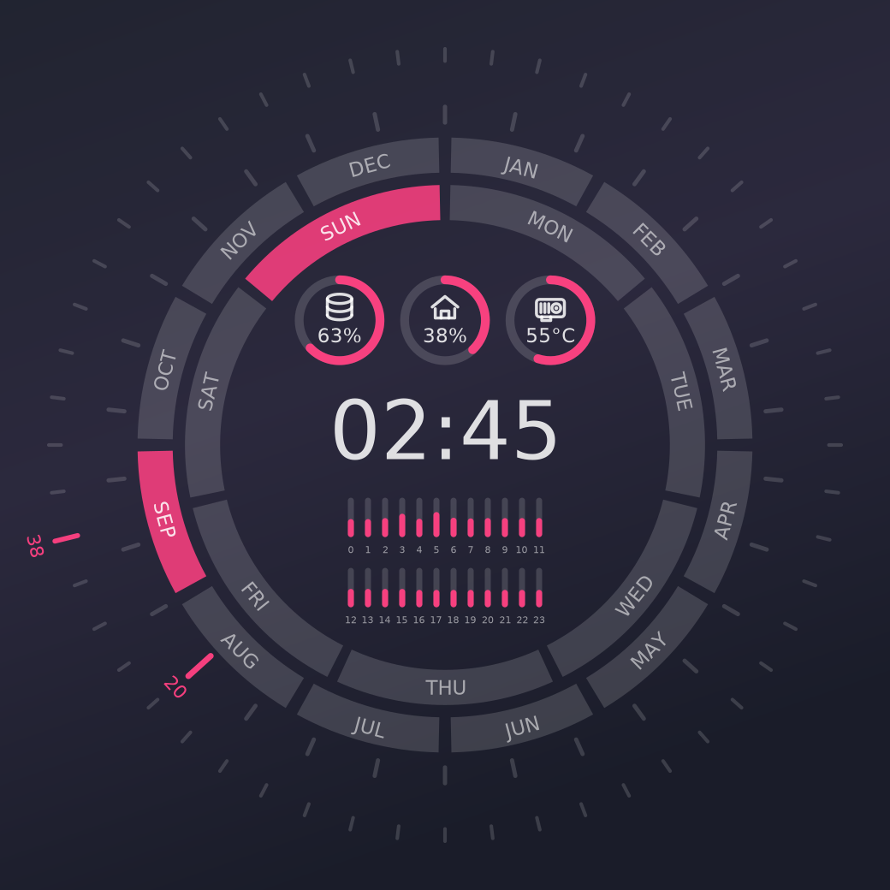
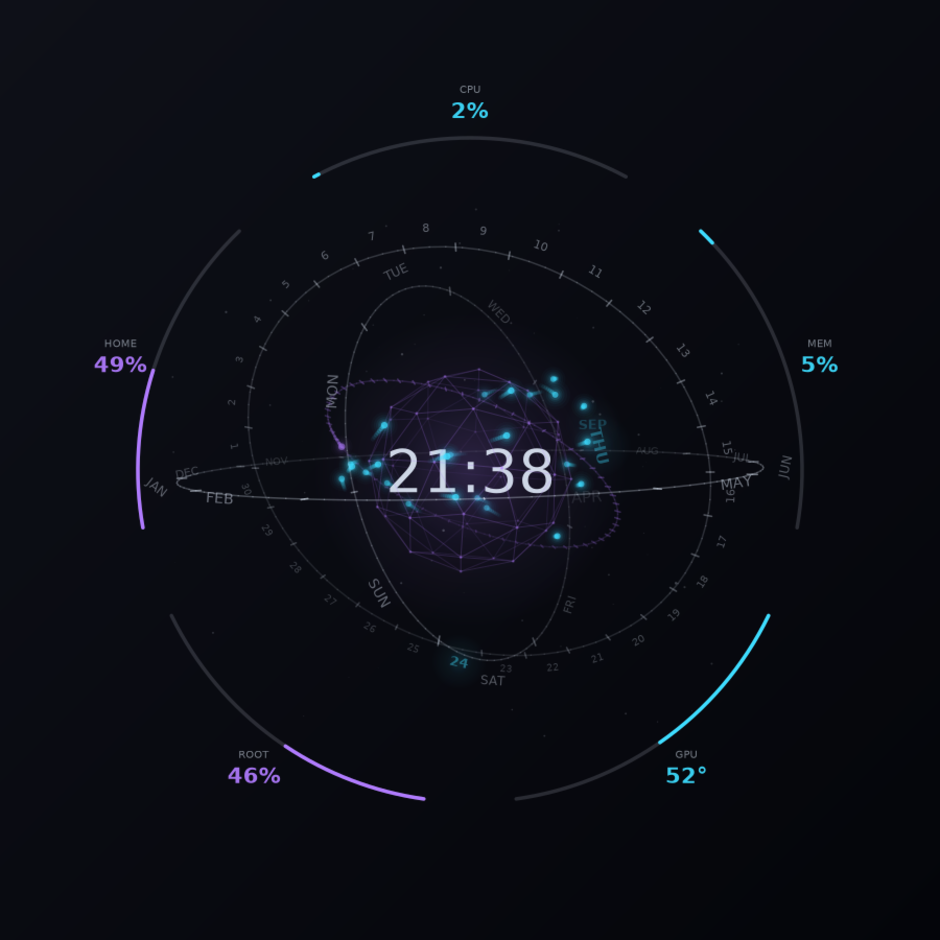

Conky

<b>HowTo:</b>

(1) Install the lm-sensors package.

(2) Run sudo sensors-detect and choose YES to all YES/no questions.

(3) At the end of sensors-detect, a list of modules that needs to be loaded will displayed. Type "yes" to have sensors-detect insert those modules into /etc/modules, or edit /etc/modules yourself. 

(4) In Ubuntu, run sudo service module-init-tools restart. This will read the changes you made to /etc/modules in step 3, and insert the new modules into the kernel.  Or, if using other distributions simply restart your computer.

(5) Set your number of physical cores in lua_widgets.lua  in USER CONFIGURATION section:
```
      number_of_physical_CPU_cores = YOUR_NUMBER_HERE
```
(6) Start conky with:
```
      conky -c start_conky
```

<b>Optionally:</b>

In file lua_widgets.lua you can enable/disable graphic card temperature, set the temperature a full bar represents (max_temperature), or change colors, transparency and position. The modernized variant adds warm_above: readings stay in the accent colour until that temperature and only shift towards HTML_warm above it, so an idle machine never looks hot. See lua_widgets.lua in USER CONFIGURATION section.

Temperatures are read straight from <i>/sys/class/hwmon</i>, so nothing is shelled out while conky runs. Steps (1)-(4) still matter because they load the kernel modules that publish those sensors, but the <i>sensors</i> command itself is no longer called.

<b>Size</b>

The conky is centred on the screen (<i>alignment = 'middle_middle'</i> in start_conky). Change that setting to move it elsewhere, or nudge it with x_rel_pos / y_rel_pos in lua_widgets.lua.

Two settings control how big the conky is. <i>widget_size</i> in lua_widgets.lua is the diameter in pixels of the outermost ring (default 450) - raise it to make everything bigger. <i>size</i> at the top of start_conky is the window the widget is drawn into (default 1000).

The rings also grow on their own as you add temperature bars: the bars wrap into evenly spaced rows and the rings expand until the block of them fits inside. Up to six bars the original layout is unchanged; 32 bars become two rows of 16 and need roughly a 1000px window. If the window is too small everything is scaled down together rather than clipped, and conky logs the size to set.

Cores are taken in the order the kernel reports them, whatever their numbering (a hybrid CPU labels them Core 0, Core 4, Core 8, ...), so number_of_physical_CPU_cores simply decides how many bars to draw.

The graphic card temperature comes from the amdgpu, nvidia or radeon hwmon entry, falling back to <i>nvidia-smi</i> only if the driver publishes no sensor. No card model needs to be configured.

In the modernized variant the GPU is not one more bar in the row: with enable_graphic_card_temperature_sensor set to Yes it gets its own dial beside the two filesystem dials, showing degrees rather than a percentage, its ring coloured by the same heat ramp as the bars. The two filesystem dials keep their spacing when it is off, and all three tuck in a little when it is on.

A sensor that is missing or unreadable now shows as an empty bar instead of blanking the whole conky.

<b>Modernized variant</b>



<i>lua_widgets_modernized.lua</i> and <i>start_conky_modernized</i> are a second, restyled copy of the same widget. Run it with:
```
      conky -c start_conky_modernized
```
It reads the same sensors and scales the same way, but redraws the dial: rounded tick rings for weeks and days, labelled arcs for months and weekdays that stay upright all the way round instead of hanging upside down at the bottom, a large clock with the date beneath it, and slim rounded temperature bars that shift from the accent colour towards HTML_warm as a core heats up. The filesystem gauges are progress rings with cairo-drawn icons in them - stacked platters for root, a house for home - with the used percentage underneath.

Colors are set by HTML_base, HTML_accent and HTML_warm, and the four opacity_* values control how strongly tracks, labels, readouts and live values are drawn. The original lua_widgets.lua is untouched, so both can be used side by side.

<b>Orrery variant</b>



<i>lua_orrery.lua</i> and <i>start_conky_orrery</i> are a third look, and an animated one. Run it with:
```
      conky -c start_conky_orrery
```
It shows the same information as the other two, built as a rotating orrery instead of a flat dial. The middle holds nothing but the clock; the date is written around it, on the hoops themselves.

Four hoops nest inside each other, each in its own plane and each a dial you read:

<ul>
<li><b>year</b> - the twelve month names, this month lit</li>
<li><b>month</b> - every day of the month as a number, today lit</li>
<li><b>weekday</b> - MON to SUN, today lit</li>
<li><b>seconds</b> - sixty divisions and no labels, swept by a head once a minute</li>
</ul>

So THU, 24 and SEP are readable straight off the rings, each larger, bold, in the accent colour and lit from behind. The hour and minute come from the clock in the middle.

Today's date is the only thing on the hoops drawn in the accent colour. Every tick is identical and every other label is the same dim grey, so there is nothing lit up that has to be accounted for. Two earlier attempts are worth knowing about, because both looked like bugs: a glowing bead riding the hoop is indistinguishable from one of the two dozen orbiting cores a few pixels away, and a pair of brighter ticks around the live division reads as two stray dashes floating near the text rather than as a bracket around it, since the ticks sit on the hoop while the label is written outside it. In this widget a round glowing dot is a CPU core and nothing else, and the lit label is the whole reading.

The highlight is snapped to the middle of the division it is in, where that division's label is written. A mark that travelled continuously would be almost on FRI by Thursday evening and almost on OCT by late September - correct to the hour and wrong to the eye. Labels lean with the hoop they ride, and they thin out on their own: where a hoop turns edge-on its divisions crowd together, so each label fades as its neighbour stops leaving it room to be read, and only the legible ones are ever on screen. Today's value never fades - if it would land on the clock it slides outward along the hoop instead, so the date is always there to be read whatever attitude the assembly is in.

Around the clock is a geodesic cage that swells with CPU load and takes its colour from the hottest core. Inside the cage, one body per CPU core circles on its own inclined orbit, faster the hotter that core runs, trailing a comet tail whose length follows its speed.

The clock is drawn on the plane through the centre of the scene, so the near half of the cage and any hoop swinging towards you cross <i>in front of</i> the numerals while the far half stays behind them.

<b>The readouts</b>

Five arcs sit around the outside - CPU, memory, GPU temperature, root and home - spaced evenly from the top. With <i>enable_graphic_card_temperature_sensor</i> set to No there are four, and they re-space themselves; the layout follows the count rather than the count being fitted to the layout.

Colour says what kind of thing a readout is, never where it sits. CPU and memory share the accent colour because both are what the machine is doing this second; root and home share the second colour because both are how full a disk is; the GPU is the only one that changes colour as its value moves, riding the same heat ramp as the orbiting cores. Set <i>root_filesystem</i> and <i>home_filesystem</i> to the mount points you want.

Conky offers no 3D and this uses none: it is a software renderer written against cairo's 2D API. Points are turned by a 3x3 matrix, divided through by depth for perspective, collected into one list and painted back to front. Everything fades with distance, which is what keeps a wireframe from reading as a flat tangle.

<b>Speed and cost</b>

The frame rate is <i>fps</i> at the top of start_conky_orrery, which sets <i>update_interval</i>; keep <i>target_fps</i> in lua_orrery.lua in step with it. The whole frame is redrawn every tick, so this is also what the widget costs: at the default 20fps, with 24 cores in orbit and fifty-odd labels on the hoops, it measures about 8% of one core - a quarter of one percent of a 32-thread machine. Drop it to 10 on a laptop; it still animates perfectly well.

<i>motion</i> scales every speed at once. 1 is the designed pace, 0 freezes the assembly into a still while the clock and the readouts keep updating. Turn it up for a few seconds if you want to record a clip that shows a whole revolution.

The numbers behind the widget are read once a second, not once a frame, and eased towards from every frame, so the readouts glide rather than step and no <i>${...}</i> is parsed twenty times a second.

<b>Options</b>

The same <i>number_of_physical_CPU_cores</i>, <i>enable_graphic_card_temperature_sensor</i>, <i>max_temperature</i> and <i>warm_above</i> as the other two variants, plus:

<i>widget_size</i> (default 640) is the diameter of the outermost hoop in pixels; the readout values are written outside it, so the widget really spans about 15% more than that, and the window it is drawn into (<i>size</i> at the top of start_conky_orrery, default 820) has to clear the larger figure. Conky will make the window a little larger than asked. <i>camera_turn_seconds</i>, <i>camera_rock_seconds</i>, <i>camera_pitch</i> and <i>camera_rock</i> set how the view moves. <i>show_dust</i> and <i>dust_count</i> control the ambient particles, <i>show_readouts</i> the four outer arcs, and <i>depth_fade</i> how much brightness the far side keeps - raise it towards 1 to flatten the picture, drop it for a deeper fade. Colours are <i>HTML_base</i>, <i>HTML_accent</i>, <i>HTML_second</i> and <i>HTML_warm</i>.

On a machine with many cores the sky gets busy; <i>number_of_physical_CPU_cores</i> caps how many bodies are drawn.

All three variants read the same sensors and are independent of each other, so any of them can be run side by side.
