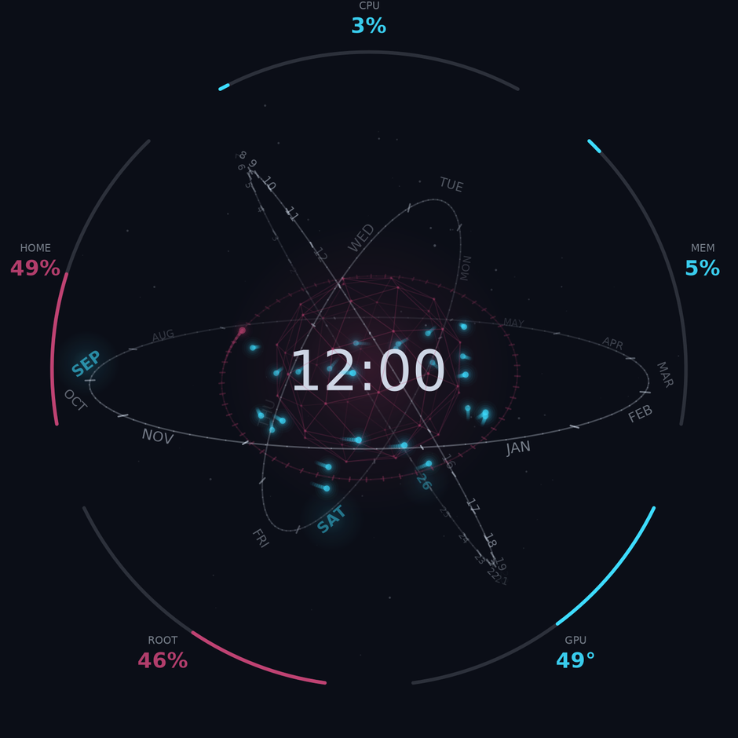
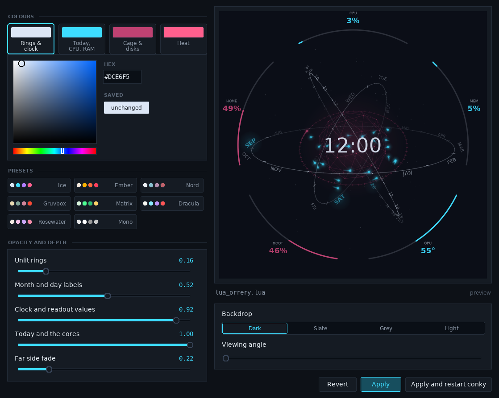

# Conky Orrery

An animated 3D armillary clock for conky. The date is read off four rotating
hoops, the clock sits in the middle inside a wireframe cage, and every orbiting
point of light is one of your CPU cores — moving faster the hotter it runs.



Conky offers no 3D and this uses none. It is a software renderer written
against cairo's 2D API: points are turned by a 3×3 matrix, divided through by
depth for perspective, then painted back to front. The clock is depth-sorted
along with everything else, which is why the near half of the cage crosses *in
front of* the numerals while the far half stays behind them.

## Run it

```bash
cd Conky_Orrery && conky -c start_conky_orrery
```

The config's `lua_load` is relative, and conky resolves that against the config
file's own directory — so an absolute path works from anywhere:

```bash
conky -c /path/to/Conky_Orrery/start_conky_orrery
```

Copying `start_conky_orrery` away from `lua_orrery.lua` breaks it; keep the two
together.

### Requirements

- conky 1.10 or newer, built with Lua and cairo support
- `lm-sensors` set up far enough that `/sys/class/hwmon` publishes your CPU
  temperatures. `sensors-detect` loads the kernel modules; the `sensors` binary
  itself is never called, the widget reads the sysfs files directly.

No fonts, themes or packages beyond that. The colour editor additionally wants
Python 3 with tkinter, which ships with Python on most distributions (Debian
and Ubuntu split it out as `python3-tk`).

## Reading it

Four hoops, each a dial:

| Hoop | Shows | Lit |
|---|---|---|
| outermost | the twelve months | this month |
| second | every day of the month | today |
| third | MON to SUN | today |
| innermost | sixty seconds, unlabelled | a head sweeping once a minute |

So the month, the day and the weekday are readable straight off the rings —
**SEP**, **26** and **SAT** in the picture above — each larger, bold, in the
accent colour and lit from behind. The hour and minute come from
the clock in the middle.

Today's date is the only thing on the hoops drawn in the accent colour. Every
tick is identical and every other label is the same dim grey, so there is
nothing lit up that has to be accounted for. Labels thin out on their own where
a hoop turns edge-on and its divisions crowd together, and today's value never
fades — if it would land on the clock it slides outward along the hoop instead.

Around the clock is a geodesic cage that swells with CPU load and takes its
colour from the hottest core. Inside it, one body per CPU core circles on its
own inclined orbit, faster the hotter that core runs, trailing a comet tail
whose length follows its speed. **A round glowing dot is a CPU core and nothing
else.**

Five arcs sit around the outside — CPU, memory, GPU temperature, root and home —
spaced evenly from the top. With `enable_graphic_card_temperature_sensor` set to
`No` there are four and they re-space themselves.

Colour says what kind of thing a readout is, never where it sits. CPU and memory
share the accent colour because both are what the machine is doing this second;
root and home share the second colour because both are how full a disk is; the
GPU is the only one that changes colour as its value moves, riding the same heat
ramp as the orbiting cores.

## Changing the colours

There is a small editor for this, so you do not have to restart conky to find
out what a colour looks like:

```bash
cd Conky_Orrery && ./orrery_colors.py
```



Pick one of the four colours with the chips at the top, drag around the
saturation square and hue strip, and the preview on the right redraws as you go.
Nothing is written to `lua_orrery.lua` until you press **Apply**, and the
previous file is kept as `lua_orrery.lua.bak`.

The preview is the real widget, not an impression of it. Every redraw writes
your candidate settings into a throwaway copy of `lua_orrery.lua` and draws a
frame of *that* through `orrery_preview.lua` — so what you are looking at is the
file Apply is about to save. There is no second implementation that could drift
away from the first.

A few things it gives you that editing the file by hand does not:

- **Presets** — Ice, Ember, Nord, Gruvbox, Matrix, Dracula, Rosewater and Mono,
  shown as the four colours they would set, as starting points rather than
  destinations. They change the colours only and leave your opacity settings
  alone.
- **Saved** — the swatch under the hex box is what is currently on disk for the
  colour you are editing. Click it to put that one colour back, which is finer
  grained than Revert when only one guess went wrong.
- **Backdrop** — conky draws on a transparent window, so how the widget reads
  depends entirely on the wallpaper behind it. Check it against a light one
  before deciding a colour works.
- **Viewing angle** — the assembly turns once every 150 seconds in use, so a
  still only shows you one pose. This looks at it from further round.
- **Apply and restart conky** — conky loads the Lua script once at startup and
  does not reload it, so a colour change needs a restart to take effect. This
  button restarts only the orrery, leaving any other conky you have running
  alone.

The two controls under the preview affect the preview only; everything in the
left column is a setting that gets written to the file.

Settings whose value you did not change are left completely alone, down to the
case of their hex digits, so pressing Apply does not churn the file.

`orrery_preview.lua` also works on its own, which is useful on a Wayland session
where a compositor will not let an X11 client grab the screen:

```bash
lua orrery_preview.lua lua_orrery.lua out.png 900
```

## Settings

All of them live in the `USER CONFIGURATION` block at the top of
`lua_orrery.lua`. The ones worth knowing about:

| Setting | Default | What it does |
|---|---|---|
| `widget_size` | 640 | diameter of the outermost hoop, in pixels |
| `motion` | 1.0 | scales every speed at once; 0 freezes the assembly |
| `number_of_physical_CPU_cores` | 0 | how many cores to put in orbit; 0 means all of them |
| `enable_graphic_card_temperature_sensor` | Yes | whether the GPU gets a readout |
| `max_temperature` | 100 | what a body at the outermost orbit represents, in °C |
| `warm_above` | 70 | where colours start shifting towards `HTML_warm` |
| `root_filesystem`, `home_filesystem` | `/`, `/home` | mount points for the two disk readouts |
| `camera_*` | — | how the view turns and rocks |
| `show_dust`, `dust_count` | Yes, 80 | ambient particles, for parallax |
| `show_readouts` | Yes | the five outer arcs |
| `depth_fade` | 0.22 | how much brightness the far side keeps; 1 flattens it |
| `font_name` | DejaVu Sans | any family fontconfig knows |

`widget_size` is the outermost hoop, but the readout values are written outside
it, so the widget really spans about 15% more than that. The window it is drawn
into is `size` at the top of `start_conky_orrery` (default 820) and has to clear
the larger figure; conky will make the window a little larger than asked.

## Speed and cost

The frame rate is `fps` at the top of `start_conky_orrery`, which sets
`update_interval`; keep `target_fps` in `lua_orrery.lua` in step with it.

The whole frame is redrawn every tick, so the frame rate is also what the widget
costs. At the default 20fps, with 24 cores in orbit and the hoop labels, it
measures about 8% of one core — a quarter of one percent of a 32-thread machine.
Drop `fps` to 10 on a laptop; it still animates perfectly well.

The numbers behind it are read once a second, not once a frame, and eased
towards from every frame, so the readouts glide rather than step and no `${...}`
is parsed twenty times a second.

## Starting it at login

On a desktop that honours XDG autostart — KDE, GNOME, XFCE and most others —
drop a file at `~/.config/autostart/conky-orrery.desktop`:

```ini
[Desktop Entry]
Type=Application
Name=Conky Orrery
Exec=conky --pause=5 --config=/path/to/Conky_Orrery/start_conky_orrery
Path=/path/to/Conky_Orrery
Terminal=false
X-GNOME-Autostart-enabled=true
```

The `--pause=5` gives the desktop a moment to finish coming up first.

## Credits

Part of [Conky-themes](../). Built on the sensor and scaling code from
`Conky-Calendar-Extra`, whose circular calendar this started life as.
